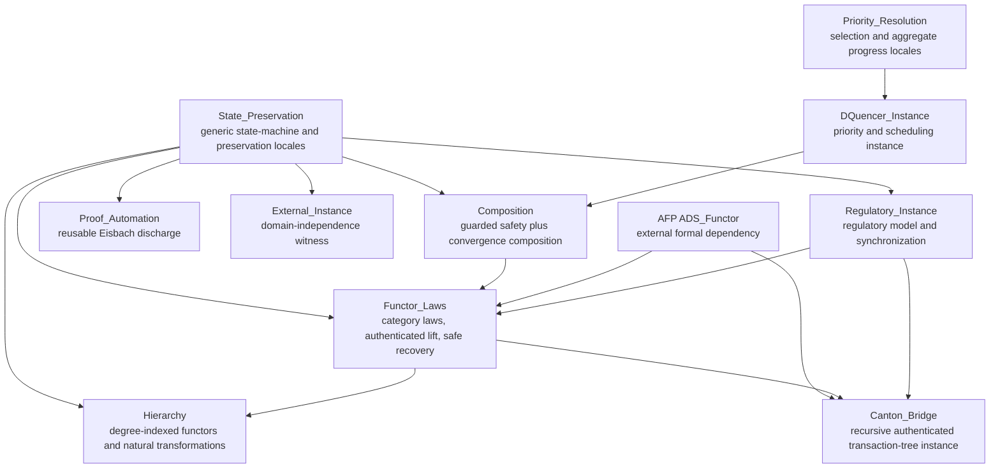

<div align="center">
  

  <p><strong>Machine-checked model-level foundations for cross-domain state preservation.</strong></p>

  [](Cross_Domain_State_Preservation/ROOT)
  [](https://isabelle.in.tum.de/)
  [](CONTRIBUTING.md#building-and-checking-the-proofs)
  [](https://arxiv.org/abs/2604.03844)
  [](LICENSE)

  [Proof scope](#verified-model-level-results) |
  [Architecture](#theory-architecture) |
  [Build](#reproduce-the-proofs) |
  [Mapping](FORMAL_MODEL_MAPPING.md) |
  [Paper](docs/document.pdf)
</div>

> This repository proves properties of an abstract Isabelle/HOL model. It does
> not prove a refinement to Rust, Solidity, EVM bytecode, a bridge, a network,
> a BFT implementation, or a deployed system. It is not a security audit,
> production certification, or legal-compliance determination.

## What this artifact is

The `Cross_Domain_State_Preservation` session contains ten Isabelle theories
for compositional cross-domain state synchronization. It develops reusable
state-preservation morphisms, regulatory and non-regulatory instances,
deterministic priority selection, conditional aggregate progress, authenticated
views, functor laws, guarded model-level convergence, and a degree-indexed
synchronization hierarchy.

The current tree is a full ten-theory AFP resubmission candidate. An earlier
version was submitted to the Archive of Formal Proofs on 2026-03-25; this
expanded candidate has not yet been uploaded or accepted as an AFP entry.
Repository publication, AFP submission, review, and acceptance are separate
states.

## Verified model-level results

| Layer | Representative results | Essential boundary |
| --- | --- | --- |
| State preservation | `regulatory_homomorphism`, `valid_state_preservation`, `sequential_preservation` | Atomic finite-domain model |
| Regulatory instance | terminal confiscation, universal confiscation reachability, isolation, no self-loops | Five states, seven actions, declared transition relation |
| Priority and progress | unique maximum selection, `starvation_bound`, closed-count completion | Injective priorities and deterministic in-roster fairness assumptions |
| Composition and convergence | guarded safety and existential bounded run to validity | Recovery uses Hilbert choice and is not executable |
| Authenticated functor | identity/composition/associativity, merge and blinding soundness, Canton tree instance | Model-level authenticated views, not protocol traces |
| Degree hierarchy | natural transformations, capability-sensitive reconciliation, under-provisioning counterexample | Degree means coupling breadth, not the product's operational S0-S3 semantics |
| Domain independence | TCP-inspired endpoint/tracker instance | Abstract example, not RFC 793 or OS conntrack conformance |

Every row above is shorthand. The authoritative theorem-to-target map,
assumptions, open obligations, and proposed test correspondences are in
[`FORMAL_MODEL_MAPPING.md`](FORMAL_MODEL_MAPPING.md).

## Theory architecture



The session dependencies declared in
[`Cross_Domain_State_Preservation/ROOT`](Cross_Domain_State_Preservation/ROOT)
are `HOL-Library`, `HOL-Eisbach`, and the AFP session `ADS_Functor`.

## Assurance boundary

### Established within the model

- all ten tracked theories build under the declared Isabelle session;
- the source is `sorry`/`oops`-free;
- named results follow from the locales, definitions, and assumptions stated
  in the theories;
- the regulatory, authenticated, hierarchy, Canton-tree, and external
  instances discharge their declared Isabelle obligations.

### Not established

- Isabelle-to-Rust, Isabelle-to-Solidity, Isabelle-to-EVM, or model-to-code
  refinement;
- distributed lock, timeout, rollback, finality, or concurrent interleaving
  correctness;
- probabilistic VRF behavior, adversarial BFT protocol execution, or network
  liveness;
- per-request fairness or open-system progress under continuous arrivals;
- cryptographic implementation correctness;
- a live deployment, operational security, audit, or legal result.

These are open or external obligations, not implied consequences of a green
proof build.

## Reproduce the proofs

### Prerequisites

- Isabelle `2025-2`
- an AFP checkout compatible with that Isabelle release
- the AFP `ADS_Functor` session available through registration or `-d`

Register the AFP once:

```bash
isabelle components -u /path/to/afp/thys
```

Or pass both directories for each build:

```bash
isabelle build \
  -d . \
  -d /path/to/afp/thys \
  Cross_Domain_State_Preservation
```

Expected completion includes:

```text
Finished Cross_Domain_State_Preservation
```

Generate the theory document:

```bash
isabelle build \
  -d . \
  -d /path/to/afp/thys \
  -o document=pdf \
  Cross_Domain_State_Preservation
```

The tracked [candidate document](docs/document.pdf) is provided for reading.
An independent assurance claim should identify the exact commit, Isabelle and
AFP revisions, command, and resulting session log.

## Repository map

| Path | Purpose |
| --- | --- |
| `Cross_Domain_State_Preservation/*.thy` | Ten authoritative Isabelle theory sources |
| `Cross_Domain_State_Preservation/ROOT` | Session graph, dependencies, and document inputs |
| `Cross_Domain_State_Preservation/document/` | Isabelle/LaTeX document source |
| `docs/document.pdf` | Rendered candidate paper |
| `FORMAL_MODEL_MAPPING.md` | Theorem-to-target mapping, assumptions, gaps, and proposed tests |
| `CONTRIBUTING.md` | Review channels, proof reproduction, and contribution policy |
| `SECURITY.md` | Sensitive-report routing and assurance boundary |
| `CITATION.cff` | Machine-readable citation metadata |

Generated Isabelle heaps, local output, editor state, and machine-specific
paths are excluded from the public tree.

## Independent review and contributions

The highest-value contributions are counterexamples, overly strong assumption
reports, model-scope challenges, reproduction results, and clarity fixes.
Theory changes are issue-first because this mirror must remain aligned with
the scholarly and AFP candidate.

Read [CONTRIBUTING.md](CONTRIBUTING.md) before opening a Pull Request. Use the
issue forms for public proof or documentation questions. Report sensitive
vulnerabilities through [SECURITY.md](SECURITY.md), never in a public issue.
Support and project decision boundaries are in [SUPPORT.md](SUPPORT.md) and
[GOVERNANCE.md](GOVERNANCE.md).

## Publications and related work

- Jinwook Kim, *The Cross-Domain State Preservation Functor: A Mechanized
  Theory of Regulatory State Synchronization in Isabelle/HOL*,
  [arXiv:2604.03844](https://arxiv.org/abs/2604.03844).
- Jinwook Kim and Jonghun Hong, *A Regulatory Compliance Protocol for Asset
  Interoperability Between Traditional and Decentralized Finance in Tokenized
  Capital Markets*,
  [arXiv:2603.29278](https://arxiv.org/abs/2603.29278).
- Andreas Lochbihler and Ognjen Marić, *Authenticated Data Structures as
  Functors in Isabelle/HOL*,
  [AFP: ADS_Functor](https://www.isa-afp.org/entries/ADS_Functor.html).

Use [CITATION.cff](CITATION.cff) and cite the exact commit when referring to
the mechanized artifact.

## License and disclaimer

The repository is licensed under the
[BSD 3-Clause License](LICENSE). The license includes warranty and liability
limitations. [DISCLAIMER.md](DISCLAIMER.md) summarizes the model, academic,
implementation, and deployment boundaries without replacing the license.

Maintainer: Jinwook Kim (Jay), `jay@oraclizer.io`.
