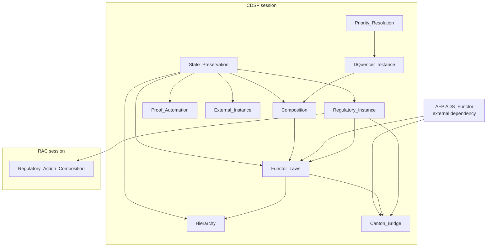

<div align="center">
  

  <p><strong>Machine-checked model-level foundations for cross-domain state preservation and regulatory action composition.</strong></p>

  [](#formal-artifact-catalog)
  [](https://isabelle.in.tum.de/)
  [](CONTRIBUTING.md#building-and-checking-the-proofs)
  [](#repository-maintenance-status)
  [](LICENSE)

  [Proof scope](#verified-model-level-results) |
  [Artifacts](#formal-artifact-catalog) |
  [Architecture](#theory-architecture) |
  [Build](#reproduce-the-proofs) |
  [Mapping](FORMAL_MODEL_MAPPING.md)
</div>

> **Mechanized assurance.** The repository contains two composable
> Isabelle/HOL sessions. Their tracked theories are `sorry`/`oops`-free and
> reproducibly check under Isabelle2025-2 with the declared AFP dependency.
> Claims are model-level and bounded by the assumptions recorded here and in
> [`FORMAL_MODEL_MAPPING.md`](FORMAL_MODEL_MAPPING.md).

## Repository maintenance status

This is a **production-maintained public research repository**. The
designation covers repository operations: reviewable changes, reproducible
proof and document builds, session-scoped releases, integrity manifests,
automated public-surface checks, security reporting, and change governance.
It does not designate either artifact as a production implementation,
deployment, audit, legal opinion, or model-to-code refinement.

## Formal artifact catalog

This catalog lists the formal-verification artifacts released from this
repository. Each row is an independently buildable Isabelle session and a
separate review and release unit. **Source** opens the authoritative session
`ROOT`; **PDF** is the session-named reading copy; and **Manifest** records the
source and PDF hashes together with the document-build identity.

| Artifact | Role | Verification focus | Entry points |
| --- | --- | --- | --- |
| **CDSP** | Foundation | Preservation morphisms, priority and conditional progress, authenticated views, guarded convergence, and the synchronization-degree hierarchy | [Source](Cross_Domain_State_Preservation/ROOT) · [PDF](Cross_Domain_State_Preservation/release/Cross_Domain_State_Preservation.pdf) · [Manifest](Cross_Domain_State_Preservation/release/manifest.json) |
| **RAC** | Extension | Regulatory outcomes, pair commutativity, provenance, transfer gates, traces, atomic queues, and finite normal forms | [Source](Regulatory_Action_Composition/ROOT) · [PDF](Regulatory_Action_Composition/release/Regulatory_Action_Composition.pdf) · [Manifest](Regulatory_Action_Composition/release/manifest.json) |

**Role taxonomy**

- **Foundation:** introduces reusable formal definitions and base laws.
- **Extension:** imports a repository session to establish an additional
  checked result set.
- **Bridge:** proves a correspondence with an external model or formalization.
- **Application:** instantiates a formal model for a bounded domain case.

The role classifies an artifact's primary formal relationship, not its
maturity, publication venue, or acceptance state. CDSP is the reusable
foundation; RAC is an extension because it imports CDSP's
`Regulatory_Instance`. RAC does not import or extend `ADS_Functor`.

An earlier version of CDSP was submitted to the Archive of Formal Proofs on
2026-03-25 but was not accepted as an AFP entry. Neither session in this
repository is an AFP entry. Repository publication, preprint publication,
submission, review, and acceptance are separate states.

## Verified model-level results

| Session | Representative results | Essential boundary |
| --- | --- | --- |
| CDSP — state preservation | `regulatory_homomorphism`, `valid_state_preservation`, `sequential_preservation` | Atomic finite-domain model |
| CDSP — priority and progress | unique maximum selection, `starvation_bound`, closed-count completion | Injective priorities and deterministic in-roster fairness assumptions |
| CDSP — composition and convergence | guarded safety and existential bounded run to validity | Recovery uses Hilbert choice and is not executable |
| CDSP — authenticated functor | identity/composition/associativity, merge and blinding soundness, Canton tree instance | Model-level authenticated views, not protocol traces |
| CDSP — degree hierarchy | natural transformations, capability-sensitive reconciliation, under-provisioning counterexample | Degree means coupling breadth, not operational S0-S3 semantics |
| RAC — action algebra | all 21 distinct-label pairs classified as 12 commuting and 9 noncommuting, with witnesses | Concrete five-state, seven-label machine |
| RAC — outcomes and traces | applied/rejected/operational-failure separation, trace and unrelated-asset frame properties | No authorization, replay, or concurrency model |
| RAC — atomic queues and normal forms | completed-step validity and consistency; exactly 60 reachable transformation vectors | Atomic completed steps, not partial propagation or rollback |

Every row is shorthand. The authoritative theorem-to-target map, assumptions,
open obligations, and proposed implementation correspondences are in
[`FORMAL_MODEL_MAPPING.md`](FORMAL_MODEL_MAPPING.md).

## Theory architecture



The CDSP session depends on `HOL-Library`, `HOL-Eisbach`, and the AFP session
`ADS_Functor`. RAC extends the built CDSP session and imports its regulatory
instance explicitly.

## Assurance boundary

### Established within the models

- both declared sessions and all eleven tracked theories build;
- the theory sources contain no `sorry` or `oops`;
- named results follow from the definitions, locales, and assumptions stated
  in the theories;
- RAC's pair inventory, witnesses, and 60 normal forms are checked in the
  Isabelle kernel rather than asserted from an external enumeration.

### Not established

- Isabelle-to-Rust, Isabelle-to-Solidity, Isabelle-to-EVM, or model-to-code
  refinement;
- distributed lock, timeout, rollback, finality, or concurrent interleaving
  correctness;
- authorization, identity, replay protection, or correctness of a concrete
  transfer-policy oracle;
- probabilistic VRF behavior, adversarial BFT execution, network liveness, or
  partial propagation;
- cryptographic implementation correctness, legal truth, live deployment,
  operational security, or audit status.

These are open or external obligations, not implied consequences of a green
proof build.

## Reproduce the proofs

### Prerequisites

- Isabelle `2025-2`
- an AFP checkout compatible with that Isabelle release
- the AFP `ADS_Functor` session available through registration or `-d`

Register the AFP once:

```bash
isabelle components -u /path/to/afp/thys
```

Check both sessions from the repository root:

```bash
isabelle build \
  -d . \
  -d /path/to/afp/thys \
  Cross_Domain_State_Preservation Regulatory_Action_Composition
```

Expected completion includes:

```text
Finished Cross_Domain_State_Preservation
Finished Regulatory_Action_Composition
```

Generate a session document in a chosen output directory:

```bash
isabelle build \
  -d . \
  -d /path/to/afp/thys \
  -o document=pdf \
  -o document_output=/path/to/output \
  Regulatory_Action_Composition
```

Isabelle's build output may be named `document.pdf`. That is a transient build
artifact. A tracked public reading copy is accepted only under
`<Session>/release/<Session>.pdf`, with the exact case-sensitive session name.
Generic `document.pdf` files are not public release artifacts.

An independent assurance claim should identify the exact commit, Isabelle and
AFP revisions, command, and resulting session log.

## Repository map

| Path | Purpose |
| --- | --- |
| `ROOTS` | Registers both repository sessions |
| `Cross_Domain_State_Preservation/*.thy` | Ten authoritative CDSP theories |
| `Cross_Domain_State_Preservation/document/` | CDSP Isabelle/LaTeX document source |
| `Cross_Domain_State_Preservation/release/` | CDSP session-named PDF and release manifest |
| `Regulatory_Action_Composition/*.thy` | Authoritative RAC theory |
| `Regulatory_Action_Composition/document/` | RAC Isabelle/LaTeX document source |
| `Regulatory_Action_Composition/release/` | RAC session-named PDF and release manifest |
| `FORMAL_MODEL_MAPPING.md` | Theorem-to-target mapping, assumptions, gaps, and proposed tests |
| `CONTRIBUTING.md` | Review channels, proof reproduction, and contribution policy |
| `SECURITY.md` | Sensitive-report routing and assurance boundary |
| `CITATION.cff` | Repository-level citation metadata |

Generated Isabelle heaps, transient `document.pdf` files, local output, editor
state, and machine-specific paths are excluded from the public tree.

## Independent review and contributions

The highest-value contributions are counterexamples, overly strong assumption
reports, model-scope challenges, reproduction results, and clarity fixes.
Theory changes are issue-first so that each session remains a coherent,
auditable artifact.

Read [CONTRIBUTING.md](CONTRIBUTING.md) before opening a Pull Request. Use the
issue forms for public proof or documentation questions. Report sensitive
vulnerabilities through [SECURITY.md](SECURITY.md), never in a public issue.
Support and project decision boundaries are in [SUPPORT.md](SUPPORT.md) and
[GOVERNANCE.md](GOVERNANCE.md).

## Publications and related work

- Jinwook Kim, *The Cross-Domain State Preservation Functor: A Mechanized
  Theory of Regulatory State Synchronization in Isabelle/HOL*,
  [arXiv:2604.03844](https://arxiv.org/abs/2604.03844).
- Jinwook Kim and Jonghun Hong, *A Regulatory Compliance Protocol for Asset
  Interoperability Between Traditional and Decentralized Finance in Tokenized
  Capital Markets*,
  [arXiv:2603.29278](https://arxiv.org/abs/2603.29278).
- Andreas Lochbihler and Ognjen Marić, *Authenticated Data Structures as
  Functors in Isabelle/HOL*,
  [AFP: ADS_Functor](https://www.isa-afp.org/entries/ADS_Functor.html).

Use [CITATION.cff](CITATION.cff), name the session used, and cite the exact
commit when referring to a mechanized artifact.

## License and disclaimer

The repository is licensed under the
[BSD 3-Clause License](LICENSE). The license includes warranty and liability
limitations. [DISCLAIMER.md](DISCLAIMER.md) summarizes the model, academic,
implementation, and deployment boundaries without replacing the license.

Maintainer: Jinwook Kim (Jay), `jay@oraclizer.io`.
